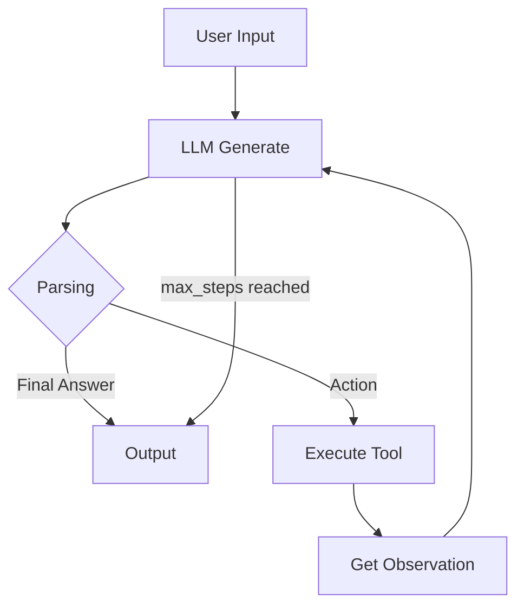

# Lab 3: Chatbot vs ReAct Agent — Team Plan (Retail Use Case)

- **Team Size**: 5 members (1 setup Gemma 3 1B + 4 developers)
- **Use Case**: Retail — Order Checker & Shipping Calculator
- **Model**: Gemma 3 1B (local, GGUF)

---

## 🧠 Luồng ReAct cần triển khai

```
User Input
    │
    ▼
[1] LLM Generate (Thought + Action)
    │
    ▼
[2] Parse Action (regex/json)
    │
    ├── "Final Answer" found → Break loop → Output
    │
    └── Tool call found → Execute tool → Observation → Quay lại [1]
    │
    Loop cho đến khi max_steps hoặc có Final Answer
```

---

## 👤 Phân công chi tiết

### Person A — Agent Core Engineer

**File chính**: `src/agent/agent.py`

**Nhiệm vụ:**
1. Viết vòng lặp ReAct hoàn chỉnh (Thought → Action → Observation → loop) trong method `run()`
2. Xử lý parsing Action từ LLM output — dùng regex để bắt pattern:
   - `Action: tool_name(arguments)`
   - `Final Answer: ...`
3. Gọi `self.llm.generate()` mỗi bước, feed lại toàn bộ lịch sử (prompt + observations) vào LLM
4. Tích hợp `self.max_steps` để không bị infinite loop
5. Sửa `get_system_prompt()` cho phù hợp với Retail tool descriptions

**Giao diện với Person B**: Import tool mapping từ `src.tools.retail_tools`, gọi trong `_execute_tool()`

**Đầu ra**: Agent chạy được vòng lặp, parse được Action, gọi được tool.

---

### Person B — Tools & Integration Engineer

**File chính**: `src/tools/retail_tools.py`

**Nhiệm vụ:**
1. Implement `get_order_weight(order_id)` — tra MOCK_ORDERS, trả về weight
2. Implement `calculate_shipping(weight, province)` — công thức: `weight * 5000` (nội thành), `weight * 10000` (ngoại thành)
3. Implement `check_stock(item_name)` — tra MOCK_INVENTORY, trả về số lượng tồn
4. Viết **Tool Descriptions** ngắn gọn để dùng trong `get_system_prompt()`:
   - `get_order_weight(order_id: string) -> string: Trả về cân nặng (kg) của đơn hàng. Input: mã đơn hàng. Output: "1.0 kg"`
   - `calculate_shipping(weight: float, province: string) -> string: Tính phí ship dựa trên weight và province. Công thức: weight * 5000. Output: "50000 VND"`
   - `check_stock(item_name: string) -> string: Kiểm tra tồn kho. Input: tên sản phẩm. Output: "Còn 10 cái"`

5. Hỗ trợ Person A: viết function `execute_tool(tool_name, args)` hoặc cập nhật `TOOLS_MAPPING`

**Đầu ra**: Các tool chạy được, có thể gọi từ Agent.

---

### Person C — Chatbot & Evaluation Lead

**File chính**: `src/chatbot.py` + `tests/evaluation.py`

**Nhiệm vụ:**
1. **Chatbot Baseline** (`src/chatbot.py`):
   - Class `SimpleChatbot` chỉ gọi `llm.generate()` trực tiếp, không có vòng lặp
   - Ghi log START/END

2. **Test Cases** (`tests/evaluation.py`):
   - Thiết kế **12-15 câu hỏi**, 3 loại:
     - `simple`: "Chào bạn", "1+1 bằng mấy?" — cả chatbot & agent đều ok
     - `multi-step`: "Đơn ORD123 nặng bao nhiêu?" (cần 1 tool), "Tôi ở Hanoi, ORD123 nặng 1.0kg thì phí ship?" (cần 2 tools)
     - `reasoning`: "Mua 2 iphone có đủ hàng không?" (cần tool + suy luận)

3. **Chạy test**: gọi cả chatbot và agent, in kết quả so sánh

**Đầu ra**: File kết quả test (CSV hoặc JSON) cho Person D.

---

### Person D — Analytics & Documentation Lead

**File chính**: `report/group_report/GROUP_REPORT.md` (copy từ TEMPLATE)

**Nhiệm vụ:**
1. **Phân tích logs** (`logs/YYYY-MM-DD.log`):
   - Đọc JSON log, trích xuất: loop_count, latency_ms, prompt_tokens, completion_tokens, cost_estimate
   - Thống kê P50/P99 latency
   - Tìm failure traces (parse error, infinite loop, hallucination)

2. **Case Study mẫu**:
   - "Agent bị lỗi parse JSON vì LLM trả kèm markdown backticks"
   - "Agent loop vô tận vì không nhận ra Final Answer"

3. **Vẽ Flowchart** (Mermaid trong markdown):


4. **Viết Group Report**: Tổng hợp từ kết quả của A, B, C

5. **Hỗ trợ Individual Report**: Mỗi người tự viết, D review format

---

### Setup Person — Gemma 3 1B (bạn)

**Nhiệm vụ:**
1. Download Gemma 3 1B GGUF (khoảng ~700MB — rất nhẹ) từ Hugging Face
   - File: `gemma-3-1b-it-Q4_K_M.gguf` (hoặc phiên bản Q4 tương tự)
2. Đặt vào thư mục `models/`
3. Config `.env`:
   ```env
   DEFAULT_PROVIDER=local
   LOCAL_MODEL_PATH=./models/gemma-3-1b-it-Q4_K_M.gguf
   ```
4. Chạy thử `test_local.py` để verify model chạy được
5. Tối ưu System Prompt & Tool Descriptions cho Gemma 3 1B (ngắn, ít few-shot)
6. Hỗ trợ Person A sửa prompt khi loop không hoạt động

---

## 📦 Cấu trúc thư mục cuối cùng

```
C:.
├── .env.example
├── .env                 ← Config provider + model path
├── requirements.txt
├── TEAM_PLAN.md
├── models/
│   └── gemma-3-1b-it-Q4_K_M.gguf   ← Bạn setup
│
├── src/
│   ├── agent/
│   │   └── agent.py                 ← Person A (core loop)
│   ├── tools/
│   │   └── retail_tools.py          ← Person B (tools)
│   ├── core/
│   │   ├── llm_provider.py          ← Có sẵn
│   │   ├── openai_provider.py       ← Có sẵn
│   │   ├── gemini_provider.py       ← Có sẵn
│   │   └── local_provider.py        ← Có sẵn
│   ├── telemetry/
│   │   ├── logger.py                ← Có sẵn
│   │   └── metrics.py               ← Có sẵn
│   └── chatbot.py                   ← Person C (baseline)
│
├── tests/
│   ├── test_local.py                ← Có sẵn
│   └── evaluation.py                ← Person C (test suite)
│
├── logs/
│   └── YYYY-MM-DD.log               ← Person D phân tích
│
└── report/
    ├── group_report/
    │   ├── TEMPLATE_GROUP_REPORT.md
    │   └── GROUP_REPORT.md          ← Person D viết
    └── individual_reports/
        ├── TEMPLATE_INDIVIDUAL_REPORT.md
        ├── REPORT_A.md              ← Person A
        ├── REPORT_B.md              ← Person B
        ├── REPORT_C.md              ← Person C
        └── REPORT_D.md              ← Person D
```

---

## ⏱ Tiến độ dự kiến (4 phases)

| Phase | Ai làm | Thời gian | Nội dung |
|-------|--------|-----------|----------|
| **Phase 1** | A + B (song song) | 60 phút | A code agent loop, B code tools |
| **Phase 2** | C + D (song song) | 45 phút | C code chatbot + test cases, D vẽ flowchart + chuẩn bị log format |
| **Phase 3** | Cả team | 60 phút | Tích hợp, chạy evaluation, sửa lỗi, ghi log |
| **Phase 4** | Cả team | 45 phút | Viết Group Report + Individual Reports |

---

## 🔗 Giao diện giữa các module

```
[chatbot.py / agent.py] ──gọi──> [LLMProvider (local = Gemma 3 1B)]
                                       │
[agent.py] ──exec──> [retail_tools.py] │
[agent.py] ──log──> [IndustryLogger]  │
```

Quan trọng: Agent loop cần pass **observation** trả về từ tool vào prompt của lần generate tiếp theo — nếu không LLM sẽ không biết kết quả tool để suy luận bước sau.

---

## ⚠️ Lưu ý cho Gemma 3 1B

- **Context window nhỏ**: Giữ prompt ngắn, không dồn lịch sử quá dài
- **Tool descriptions tối giản**: Mỗi tool 1-2 câu, không few-shot dài
- **Output format dễ parse**: Nên dùng regex raw (không yêu cầu JSON) vì model nhỏ dễ sai format
- **Action format nên dùng**: `Action: tool_name|arg1|arg2` (dùng pipe thay parentheses cho dễ parse)
