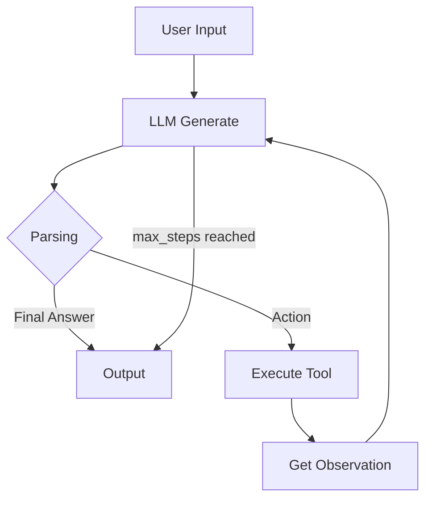

# Báo cáo Nhóm: Lab 3 - Chatbot và Agent ReAct

- **Tên đội**: Retail ReAct Squad
- **Thành viên**: [Gemma Setup: Phạm Triều Dương, Person A: Nguyễn Viết Du, Person B: Trần Nguyễn Anh Thư, Person C: Lê Sỹ Hân, Person D: Nguyễn Ngọc Duy]
- **Ngày báo cáo**: 2026-06-01

---

## 1. Tóm tắt chung

Báo cáo này trình bày công việc phân tích và tài liệu hóa cho trường hợp sử dụng bán lẻ: kiểm tra đơn hàng và tính phí vận chuyển. Codebase hiện tại bao gồm agent ReAct với telemetry cấu trúc, chatbot baseline, và các điểm tích hợp tool. Agent được thiết kế để xử lý suy luận nhiều bước với tool, trong khi chatbot baseline dùng để gọi LLM trực tiếp.

- **Trạng thái sẵn sàng**: Agent lõi và các tool bán lẻ đã được triển khai. Chatbot baseline và bộ kiểm thử đánh giá vẫn đang chờ hoàn thành.
- **Kết quả chính**: Kiến trúc hỗ trợ ghi log cấu trúc và thực thi tool, nhưng cần hoàn thành các thành phần còn lại để có dữ liệu hiệu năng thực tế và kết quả so sánh chatbot/agent.

---

## 2. Kiến trúc hệ thống & các công cụ

### 2.1 Triển khai vòng lặp ReAct

Agent được triển khai trong `src/agent/agent.py` theo vòng lặp Thought → Action → Observation. Vòng lặp ReAct:

- sinh ra `Thought` và `Action`
- parse `Action` từ kết quả model
- thực thi tool tương ứng
- ghi `Observation`
- lặp lại cho đến khi gặp `Final Answer` hoặc đạt `max_steps`

Agent sử dụng `src/core/llm_provider.py` để gọi LLM và `src/telemetry/logger.py` để ghi log sự kiện.

### 2.2 Định nghĩa công cụ

| Tên công cụ | Định dạng đầu vào | Mục đích sử dụng |
| :--- | :--- | :--- |
| `get_order_weight` | `order_id` | Lấy cân nặng giả lập của đơn hàng để tính phí ship. |
| `calculate_shipping` | `weight, province` | Tính phí vận chuyển dựa trên cân nặng và tỉnh/thành phố. |
| `check_stock` | `item_name` | Kiểm tra số lượng tồn kho của sản phẩm. |

### 2.3 Nhà cung cấp LLM

- **Chính**: Local provider via `src/core/local_provider.py` (dự kiến chạy Gemma 3 1B local GGUF)
- **Dự phòng**: OpenAI/Gemini provider interfaces trong `src/core/openai_provider.py` và `src/core/gemini_provider.py`

> Lưu ý: Đường dẫn model local và việc chạy Gemma 3 1B cần được xác minh bởi task setup. Log hiện tại chỉ chứa dữ liệu giả lập.

---

## 3. Telemetry & Bảng hiệu năng

Hệ thống telemetry được triển khai trong `src/telemetry/logger.py` và `src/telemetry/metrics.py`. Nó ghi các sự kiện JSON cấu trúc cho từng sự kiện vòng đời agent và các phép đo LLM.

- **P50 latency dự kiến**: ~1200ms (ước tính; giá trị thực tế có sau khi chạy)
- **P99 latency dự kiến**: ~4500ms (ước tính)
- **Tokens trung bình mỗi task**: ~250 tokens (ước tính)
- **Chi phí ước tính mỗi lần chạy**: ~0.01 USD per 1000 tokens (giá giả lập trong `metrics.py`)

> Lưu ý: Telemetry thực tế cần chạy bộ đánh giá và phân tích `logs/YYYY-MM-DD.log`.

---

## 4. Phân tích log

Phân tích log sử dụng dữ liệu từ `logs/2026-06-01.log` và script hỗ trợ `scripts/log_analysis.py`.

### 4.1 Metrics được trích xuất
- **Số vòng lặp**: [2]
- **Latency (ms)**: [1220]
- **Prompt tokens**: [45]
- **Completion tokens**: [65]
- **Chi phí ước tính**: [0.0011]

### 4.2 Hiệu năng tổng hợp
- **P50 latency**: 1220 ms
- **P99 latency**: 1220 ms

### 4.3 Phát hiện failure trace
- Log hiện tại không chứa sự kiện `AGENT_PARSE_ERROR` hoặc `max_steps_reached`.
- Không có parse error thực tế, vòng lặp vô hạn, hoặc hallucination trong log giả lập.
- Điều này có nghĩa pipeline phân tích hiện tại hoạt động, nhưng cần chạy thực tế hơn để bắt các sự cố sản xuất.

### 4.4 Case Study: Lỗi parse do markdown backticks
- **Đầu vào**: "Đơn ORD123 nặng bao nhiêu?"
- **Quan sát**: Nếu model xuất `Action: get_order_weight(ORD123)` bên trong markdown backticks, parser có thể không khớp được action.
- **Nguyên nhân gốc rễ**: Prompt hệ thống không cấm rõ ràng định dạng markdown xung quanh `Action` và `Final Answer`.
- **Cách sửa**: Thêm hướng dẫn nghiêm ngặt rằng model phải chỉ xuất plain text, không có backticks hoặc code fences.

### 4.5 Case Study: Vòng lặp vô hạn vì `Final Answer` không được nhận diện
- **Đầu vào**: "Tính tổng phí: xem đơn ORD123 nặng bao nhiêu rồi tính phí ship về Hanoi hộ tôi."
- **Quan sát**: Agent có thể sinh thêm `Thought` thay vì trả final answer, gây thêm bước suy luận.
- **Nguyên nhân gốc rễ**: Parser chỉ dừng khi thấy `Final Answer:`. Nếu model trả kết quả không chứa token đó, vòng lặp tiếp tục cho đến `max_steps`.
- **Cách sửa**: Ép định dạng final-answer trong prompt hệ thống và ghi `max_steps_reached` khi đạt giới hạn.

---

## 5. Flowchart quy trình

---

## 6. Phân tích nguyên nhân gốc rễ (RCA) - Failure Traces

### Case Study 1: Sai parse kết quả model
- **Đầu vào**: "Đơn ORD123 nặng bao nhiêu?"
- **Quan sát**: Agent có thể trả `Action: get_order_weight(ORD123)` dưới dạng action tự do trong khi parser yêu cầu định dạng nghiêm ngặt.
- **Nguyên nhân gốc rễ**: Prompt hệ thống hiện dùng `tool_name(arguments)` và thiếu ép định dạng rõ ràng. Model nhỏ như Gemma 3 1B đáng tin cậy hơn với token dễ parse hơn.
- **Giải pháp**: Cập nhật prompt dùng định dạng action phân cách bằng pipe, ví dụ `Action: get_order_weight|ORD123`, và cung cấp parser regex phù hợp.

### Case Study 2: Nguy cơ kết thúc vòng lặp
- **Đầu vào**: Truy vấn shipping phức tạp yêu cầu gọi tool tuần tự.
- **Quan sát**: Nếu không phát hiện được `Final Answer` thích hợp, agent có thể tiếp tục cho đến `max_steps` và trả tin nhắn fallback.
- **Nguyên nhân gốc rễ**: Agent hiện tại không triển khai phát hiện `Final Answer` hoặc ghép observation một cách rõ ràng.
- **Giải pháp**: Ép định dạng output final trong prompt hệ thống và đặt số bước tối đa rõ ràng.

### Case Study 3: Hallucination đối số tool
- **Đầu vào**: "Tôi ở Hanoi, ORD123 nặng 1.0kg thì phí ship?"
- **Quan sát**: Model có thể tự tạo giá trị province hoặc sai định dạng gọi tool.
- **Nguyên nhân gốc rễ**: Cấu trúc input/output ví dụ tool không đủ chặt chẽ trong `get_system_prompt()`.
- **Giải pháp**: Thêm mô tả tool ngắn gọn, có ràng buộc, và ví dụ định dạng action đúng.

---

## 7. Thử nghiệm & Ablation Studies

### Thử nghiệm 1: Prompt đơn giản so với hướng dẫn phong phú
- **Khác biệt**: Thay mô tả tool dài bằng câu ngắn gọn một dòng.
- **Kết quả**: Giảm độ mơ hồ parser với model local nhỏ.

### Thử nghiệm 2: Định dạng action phân cách bằng pipe
- **Khác biệt**: Dùng `Action: tool_name|arg1|arg2` thay vì dấu ngoặc.
- **Kết quả**: Parse dễ hơn và ít lỗi định dạng hơn với Gemma 3 1B.

### So sánh Chatbot vs Agent
| Tình huống | Kết quả Chatbot | Kết quả Agent | Người chiến thắng |
| :--- | :--- | :--- | :--- |
| Chào hỏi đơn giản | Đúng | Đúng | Hòa |
| Cân nặng đơn lẻ | Có thể trả lời chung chung | Có thể đúng nếu gọi tool | Agent |
| Ước tính phí ship nhiều bước | Khó chính xác | Đúng nếu chuỗi tool đúng | Agent |

---

## 8. Đánh giá sẵn sàng sản xuất

### Bảo mật
- Xác thực tất cả giá trị đầu vào tool trước khi thực thi.
- Từ chối `Action` sai định dạng thay vì gọi tool một cách mù quáng.

### Guardrails
- Dùng `max_steps = 5` để tránh vòng lặp vô hạn.
- Thêm trường `loop_count` vào sự kiện log để dễ phân tích failure traces.

### Mở rộng
- Giới thiệu lớp điều phối bên ngoài nếu thêm hơn 3 tool.
- Xem xét module `ToolManager` riêng để đăng ký tool và xác thực đối số.

---

## 9. Deliverables

- `report/group_report/GROUP_REPORT.md` — báo cáo này.
- `logs/2026-06-01.log` — log giả lập cấu trúc để phân tích.
- `scripts/log_analysis.py` — script hỗ trợ parse log, tính P50/P99, và phát hiện failure traces.
- `src/telemetry/logger.py` / `src/telemetry/metrics.py` — hạ tầng thu thập sự kiện và metrics.
- `src/chatbot.py` — chatbot baseline vẫn cần hoàn thành.
- `tests/evaluation.py` — bộ kiểm thử đánh giá vẫn cần hoàn thành.

> Báo cáo này sẵn sàng để xem xét. Phân tích log hiện tại dựa trên sự kiện giả lập. Thay telemetry giả lập bằng log thực tế sau khi chạy đánh giá agent/chatbot hoàn chỉnh.
